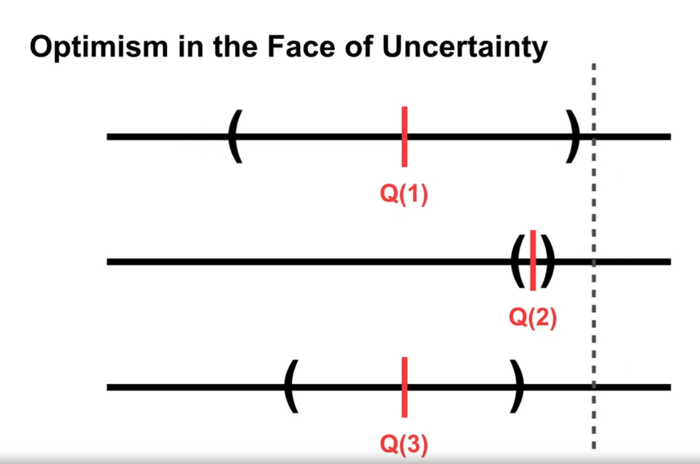

### Upper Confidence Bound (UCB) Algorithm Explained

The Upper Confidence Bound (UCB) algorithm is used to balance exploration and exploitation in decision-making under uncertainty. Here's how it works:

1. **Initialization**:
   - Start by estimating the reward \( Q(a) \) for each action \( a \).
   - Maintain a count \( n(a) \) of how many times each action has been selected.

2. **Optimism in the Face of Uncertainty**:
   - For each action, compute an upper bound for its potential reward:
     \[
     UCB(a) = Q(a) + \sqrt{\frac{2 \ln(t)}{n(a)}}
     \]
     where:
     - \( Q(a) \): Current estimated reward for action \( a \).
     - \( t \): Total number of trials so far.
     - \( n(a) \): Number of times action \( a \) has been taken.

3. **Action Selection**:
   - Select the action \( a \) with the highest \( UCB(a) \):
     \[
     a_t = \arg\max_{a} \ UCB(a)
     \]

4. **Reward Update**:
   - After receiving the reward for the selected action, update \( Q(a) \) and \( n(a) \).

### Key Insights:
- **Exploration Term**:
  \[
  \sqrt{\frac{2 \ln(t)}{n(a)}}
  \]
  ensures actions with fewer trials are explored.
  
- **Exploitation Term**:
  \[
  Q(a)
  \]
  promotes actions that already show high rewards.

- The UCB algorithm is particularly effective when reward distributions are unknown, as it prioritizes actions with high uncertainty while leveraging known high-reward actions.

